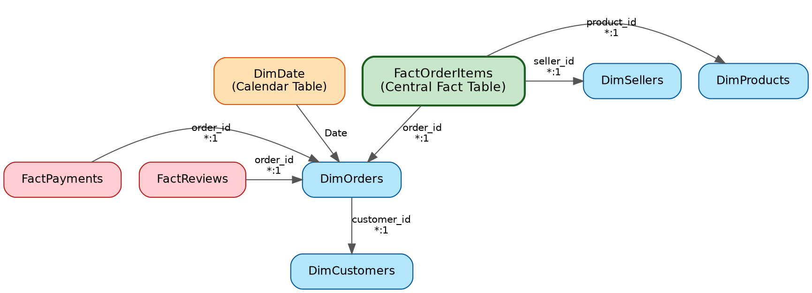
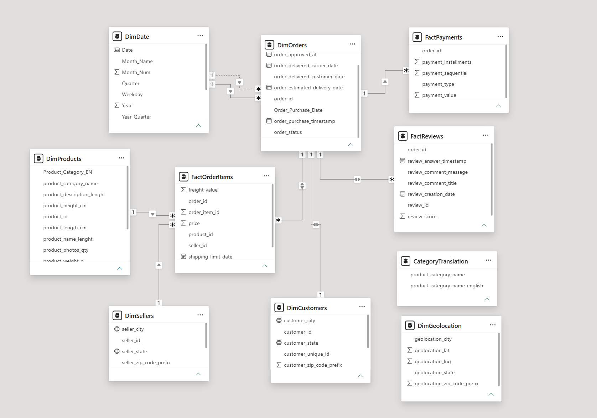
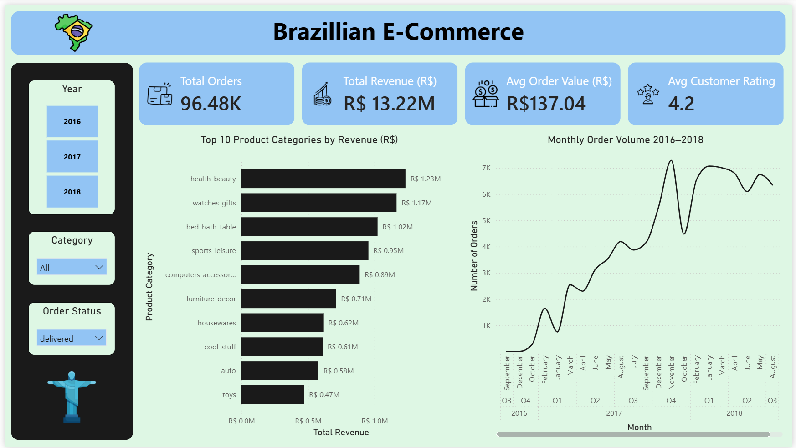
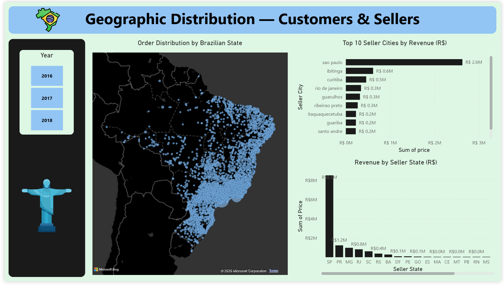
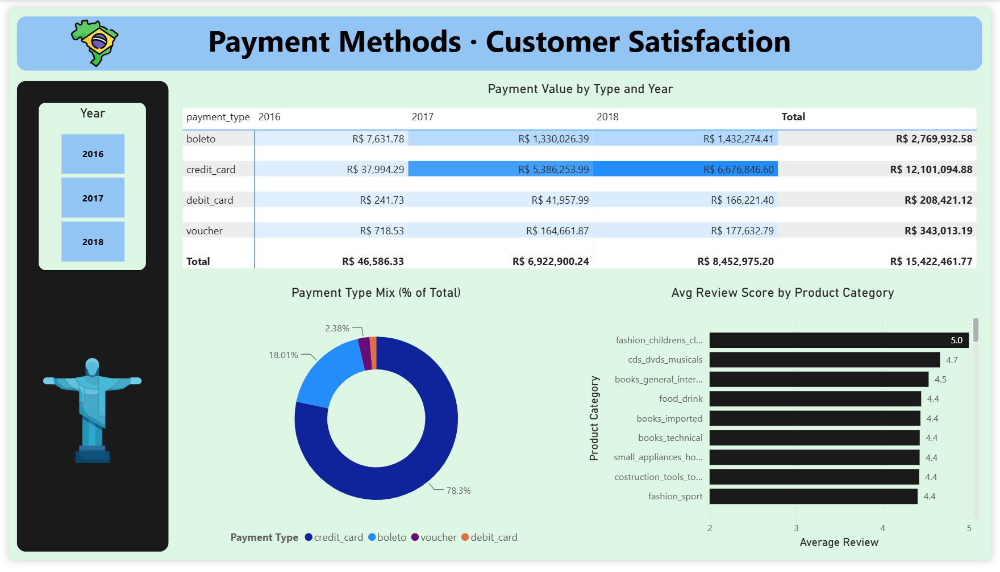

<div align="center">


# 🇧🇷 Brazilian E-Commerce Analytics
### A Power BI Data Modeling Project — Star Schema, DAX & Interactive Reporting

[](https://powerbi.microsoft.com/)
[](https://learn.microsoft.com/dax/)
[](https://www.kaggle.com/datasets/olistbr/brazilian-ecommerce)
[]()

*Nine raw CSV files, one star schema, three interactive report pages — 96,478 orders analyzed end to end.*

</div>

---

## 🧭 Table of Contents

- [📌 Overview](#-overview)
- [🛒 The Dataset](#-the-dataset)
- [⭐ Star Schema & Data Model](#-star-schema--data-model)
- [🧩 Relationships Built](#-relationships-built)
- [📊 Dashboard Preview](#-dashboard-preview)
- [🔑 Key Metrics](#-key-metrics)
- [⚙️ Tech Stack](#️-tech-stack)
- [🚀 Getting Started](#-getting-started)
- [📁 Repository Structure](#-repository-structure)
- [🎥 Video Walkthrough](#-video-walkthrough)
- [🙋 Author](#-author)

---

## 📌 Overview

This project takes the **Olist Brazilian E-Commerce dataset** — 9 separate CSV files linked by
primary and foreign keys — and turns it into a proper **star schema data model** in Power BI,
then builds a 3-page interactive report on top of it. Unlike a single-flat-file project, the
focus here is entirely on **data modeling fundamentals**:

> `9 Raw CSVs` → `Fact & Dimension Design` → `Custom DimDate Calendar` → `Star Schema Relationships` → `Hierarchies for Drill-Down` → `DAX Measures` → `3-Page Report`

Every relationship, every hierarchy, and every measure exists to answer a real business
question — which product categories drive revenue, where customers and sellers are located,
and how payment methods and customer satisfaction interact.

---

## 🛒 The Dataset

<table>
<tr>
<td width="60%">

**Brazilian E-Commerce Public Dataset by Olist** — real, anonymized commercial order data
(customer names replaced with placeholder identifiers) spanning 2016–2018.

| Field | Detail |
|---|---|
| 📁 Files | 9 CSVs, 54 columns total |
| 📦 Orders | 99,441 |
| 🛍️ Order Items | 112,650 |
| 👥 Customers | 99,441 unique |
| 🏪 Sellers | 3,095 |
| 🧾 Products | 32,951 |
| 📦 Source | [Kaggle — Olist Brazilian E-Commerce](https://www.kaggle.com/datasets/olistbr/brazilian-ecommerce) |

</td>
<td width="40%" align="center">

<br>


</td>
</tr>
</table>

**The 9 source files:**

| File | Role | Rows |
|---|---|---|
| `olist_order_items_dataset.csv` | Fact — order line items | 112,650 |
| `olist_orders_dataset.csv` | Dimension — order metadata | 99,441 |
| `olist_customers_dataset.csv` | Dimension — customer location | 99,441 |
| `olist_products_dataset.csv` | Dimension — product catalog | 32,951 |
| `olist_sellers_dataset.csv` | Dimension — seller location | 3,095 |
| `olist_order_payments_dataset.csv` | Fact — payment transactions | 103,886 |
| `olist_order_reviews_dataset.csv` | Fact — customer reviews | 99,224 |
| `olist_geolocation_dataset.csv` | Geo lookup | 1,000,163 |
| `product_category_name_translation.csv` | Category lookup (PT → EN) | 71 |

---

## ⭐ Star Schema & Data Model

`FactOrderItems` sits at the center as the primary Fact Table, surrounded by dimension tables.
`DimOrders` also acts as a shared hub for two secondary fact tables (`FactPayments`,
`FactReviews`) — a **fact constellation / galaxy schema** built on top of the core star.



**Below: the actual Model View from Power BI Desktop**, including the full column list per
table, the custom `DimDate` calendar, and the `CategoryTranslation` lookup merged into
`DimProducts`.



A custom `DimDate` calendar table was built entirely in Power Query (M code) since the raw
dataset has no dedicated date dimension — required for proper time-intelligence and drill-down
behavior.

---

## 🧩 Relationships Built

| # | From (Fact) | To (Dimension) | Key | Cardinality |
|---|---|---|---|---|
| 1 | FactOrderItems | DimOrders | `order_id` | Many-to-One |
| 2 | FactOrderItems | DimProducts | `product_id` | Many-to-One |
| 3 | FactOrderItems | DimSellers | `seller_id` | Many-to-One |
| 4 | DimOrders | DimCustomers | `customer_id` | Many-to-One |
| 5 | DimDate | DimOrders | `Date` → `order_purchase_timestamp` | One-to-Many |
| 6 | FactPayments | DimOrders | `order_id` | Many-to-One |
| 7 | FactReviews | DimOrders | `order_id` | Many-to-One |
| — | DimDate | DimOrders | `Date` → `order_delivered_customer_date` | *(inactive — reserved for delivery-date analysis)* |

**Also built:**
- 🔽 **4 drill-down hierarchies**: Date (Year → Quarter → Month), Product (Category → Product),
  Seller Location (State → City), Customer Location (State → City)
- 📐 **DAX measure**: `Avg_Order_Value = AVERAGEX(DimOrders, CALCULATE(SUM(FactOrderItems[price])))`
- 🌍 **Geography data categories** set on city/state columns to power the map visual
- 💱 **Currency formatting** (R$) applied across all monetary columns

---

## 📊 Dashboard Preview

### 1️⃣ Sales Overview



Total Orders, Total Revenue, Avg Order Value, and Avg Customer Rating up top, with a Top 10
product-category revenue chart and a monthly order-volume trend (drillable Year → Quarter →
Month) below.

### 2️⃣ Geographic Analysis



A map of order distribution across Brazilian states, plus top seller cities and total revenue
by seller state — powered by the geography data categories set in the model.

### 3️⃣ Payments & Reviews



A payment-value matrix by type and year, a payment-type mix donut, and average review score by
product category — pulling from all three fact tables through the shared `DimOrders` hub.

---

## 🔑 Key Metrics

<div align="center">

| 📦 Total Orders | 💰 Total Revenue | 💳 Avg. Order Value | ⭐ Avg. Rating |
|:---:|:---:|:---:|:---:|
| **96.48K** | **R$ 13.22M** | **R$ 137.04** | **4.2 / 5** |

</div>

---

## ⚙️ Tech Stack

| Category | Tools |
|---|---|
| 📊 BI Platform | Power BI Desktop |
| 🔧 Data Prep | Power Query (M Language) |
| 📐 Calculations | DAX (Data Analysis Expressions) |
| 🗂️ Data Source | 9 linked CSVs (Kaggle Olist dataset) |
| 🎨 Design | Built-in Power BI theme, custom KPI icon set |

---

## 🚀 Getting Started

```bash
# 1. Clone the repo
git clone https://github.com/krish-desai-123/Power-BI.git
cd "Power-BI/Brazilian E-Commerce"

# 2. Open the report
# Launch Power BI Desktop → Open → Brazilian_E-Commerce.pbix
```

If prompted for data source paths, point Power BI to the `Dataset/` folder containing all 9
CSVs. Then `Home → Refresh` to reload.

---

## 📁 Repository Structure

```
Brazilian E-Commerce/
├── Brazilian_E-Commerce.pbix     # Full Power BI report (3 pages + data model)
├── README.md                     # You are here 👋
├── Dataset/
│   ├── olist_orders_dataset.csv
│   ├── olist_order_items_dataset.csv
│   ├── olist_customers_dataset.csv
│   ├── olist_products_dataset.csv
│   ├── olist_sellers_dataset.csv
│   ├── olist_order_payments_dataset.csv
│   ├── olist_order_reviews_dataset.csv
│   ├── olist_geolocation_dataset.csv
│   └── product_category_name_translation.csv
└── Assets/
    ├── dashboard_sales_overview.png
    ├── dashboard_geographic_analysis.png
    ├── dashboard_payments_reviews.png
    ├── model_view_star_schema.png
    ├── star_schema_diagram.png
    └── (icon set: orders, revenue, average, rating, brazil, jesus)
```

---

## 🎥 Video Walkthrough

[](https://youtu.be/_Fl4zGT_P2k)

📺 **[▶ Watch the video on YouTube](https://youtu.be/_Fl4zGT_P2k)**

---

## 🙋 Author

**Krish Desai** — [@krish-desai-123](https://github.com/krish-desai-123)

<div align="center">

*⭐ If this project helped you understand Power BI data modeling, consider starring the repo!*

</div>
