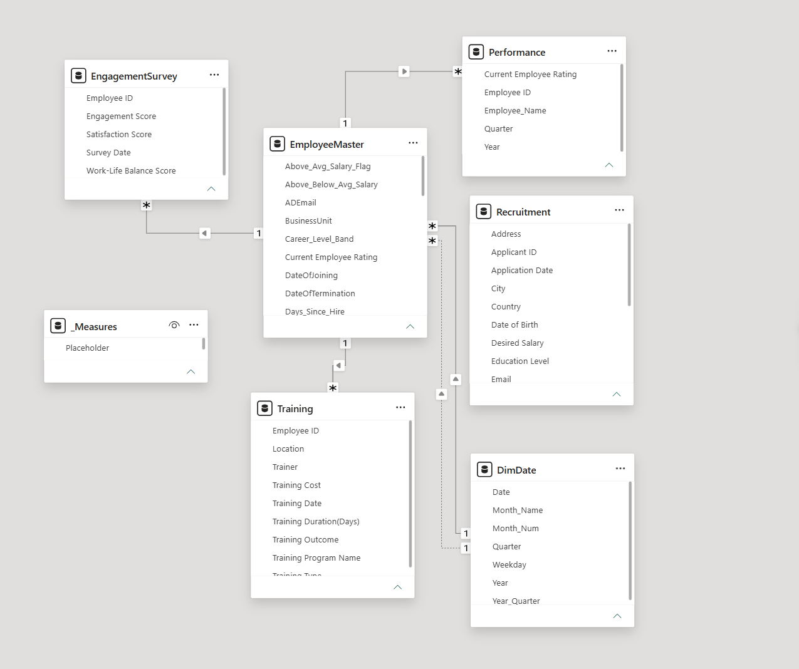
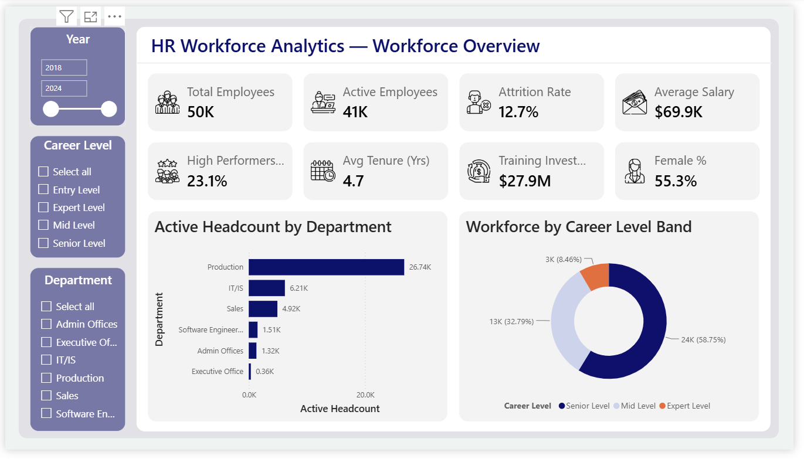
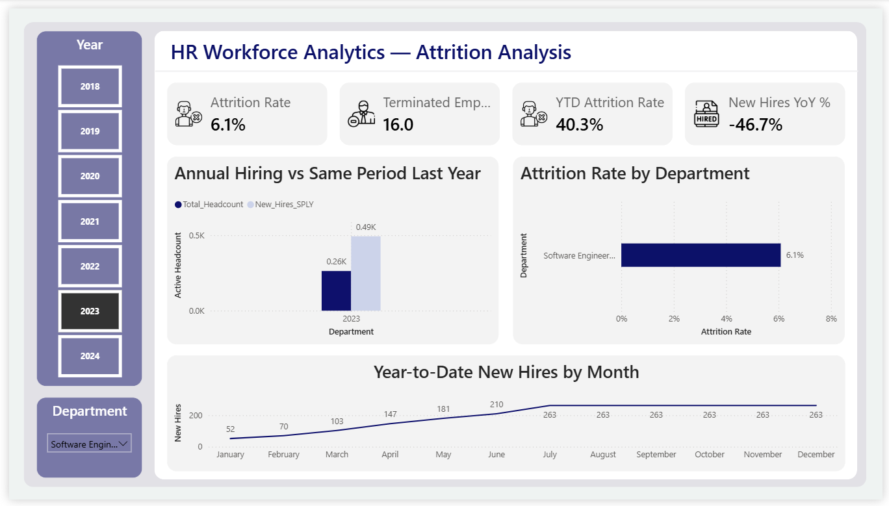
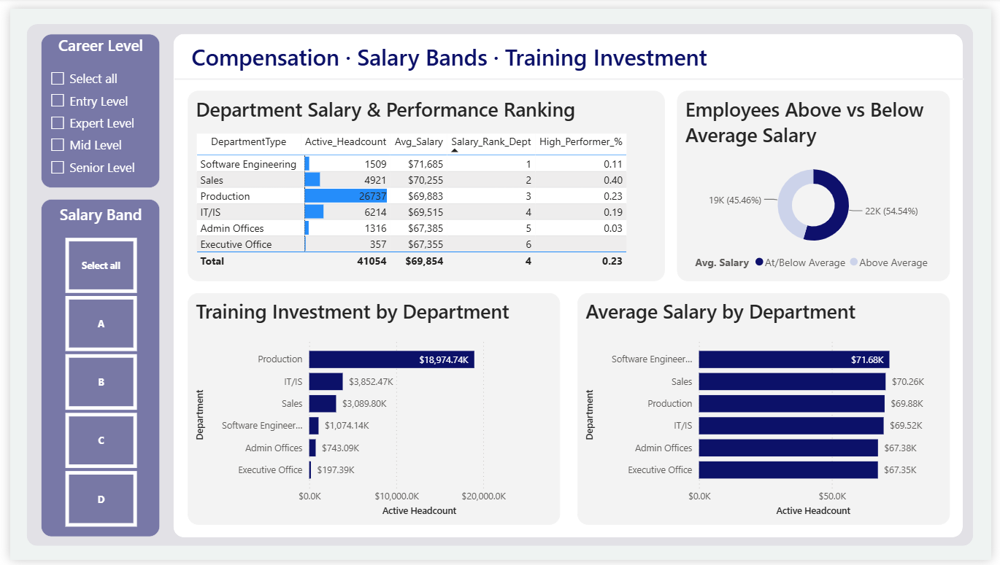

<div align="center">


# 👥 HR Workforce Analytics
### A Power BI DAX Deep-Dive — Row Context, Filter Context & Time Intelligence

[](https://powerbi.microsoft.com/)
[](https://learn.microsoft.com/dax/)
[](https://www.kaggle.com/)
[]()

*5 linked HR tables, 25+ DAX measures, and a full Time Intelligence layer — from raw employee records to a 3-page HR analytics report.*

</div>

---

## 🧭 Table of Contents

- [📌 Overview](#-overview)
- [🗂️ The Dataset](#️-the-dataset)
- [🧩 Data Model](#-data-model)
- [🧮 DAX Measures — Grouped by Concept](#-dax-measures--grouped-by-concept)
- [📊 Dashboard Preview](#-dashboard-preview)
- [🔑 Key Metrics](#-key-metrics)
- [⚙️ Tech Stack](#️-tech-stack)
- [🚀 Getting Started](#-getting-started)
- [📁 Repository Structure](#-repository-structure)
- [🎥 Video Walkthrough](#-video-walkthrough)
- [🙋 Author](#-author)

---

## 📌 Overview

This project turns a 5-table **Employee / HR dataset** into a proper analytical model and uses
it to demonstrate the full DAX toolkit — not just aggregation, but the concepts that separate a
beginner report from a production-ready one:

> `Row Context` → `Filter Context` → `CALCULATE & ALL()` → `Iterators (SUMX/AVERAGEX)` → `RANKX` → `Time Intelligence (TOTALYTD, SAMEPERIODLASTYEAR, DATEADD, USERELATIONSHIP)`

Every measure lives in a dedicated `_Measures` table, every calculated column solves a specific
business question (tenure, career banding, salary tiers), and the whole model is validated end
to end — Active + Terminated always reconciles to Total Headcount.

---

## 🗂️ The Dataset

<table>
<tr>
<td width="60%">

**Employee / HR Dataset — All in One**, 5 linked CSV files covering the full employee
lifecycle: demographics, training, engagement, performance, and recruitment.

| File | Role | Key Columns |
|---|---|---|
| `employee_data.csv` | Core employee master | Salary, DepartmentType, EmployeeStatus, DateOfJoining |
| `training_and_development_data.csv` | Training history | Training Cost, Outcome, Duration |
| `employee_engagement_survey_data.csv` | Engagement surveys | Engagement / Satisfaction / Work-Life scores |
| `performance_data.csv` | Performance ratings | Year, Quarter, Current Employee Rating |
| `recruitment_data.csv` | Applicant pipeline (standalone) | Status, Desired Salary, Education Level |

Four tables link via `Employee ID`. `Recruitment` has no `Employee ID` column — applicants
aren't employees yet — so it stays standalone, used only for pipeline-style visuals.

</td>
<td width="40%" align="center">

<br>


</td>
</tr>
</table>

---

## 🧩 Data Model



**6 tables total:** `EmployeeMaster` sits at the center, linked to `Training`, `EngagementSurvey`,
and `Performance` via `Employee ID`. A custom `DimDate` calendar (built with M code in Power
Query, marked as a Date Table) drives Time Intelligence, with **two relationships to
EmployeeMaster**:

| Relationship | Status | Purpose |
|---|---|---|
| `DimDate[Date] → EmployeeMaster[DateOfJoining]` | ✅ Active | Powers hiring measures (YTD hires, YoY %) automatically |
| `DimDate[Date] → EmployeeMaster[DateOfTermination]` | ⏸️ Inactive | Activated on demand via `USERELATIONSHIP()` for attrition measures |

`Recruitment` appears with no relationship line — it's intentionally standalone. All DAX
measures live in a dedicated `_Measures` table rather than scattered across the model.

---

## 🧮 DAX Measures — Grouped by Concept

25+ measures and calculated columns, organized by the DAX pattern they demonstrate:

<details>
<summary><b>📐 Row Context — Calculated Columns (5)</b></summary>
<br>

Evaluated once per row at refresh. Built directly on `EmployeeMaster`.

| Column | What it does |
|---|---|
| `Tenure_Years` | Years worked — branches on `EmployeeStatus`, using `TODAY()` for active employees |
| `Career_Level_Band` | Tenure-based career tier via `SWITCH(TRUE())` |
| `Full_Name` | Concatenated first + last name |
| `Salary_Band` | 4-tier compensation grouping (A = highest) |
| `Is_Active` | Binary active/inactive flag, based on `EmployeeStatus` text |

</details>

<details>
<summary><b>🔢 Basic Explicit Measures (8)</b></summary>
<br>

Live in `_Measures`, recalculate automatically with slicer context.

`Total_Headcount` · `Active_Headcount` · `Terminated_Count` · `Avg_Salary` ·
`Total_Salary_Cost` · `Avg_Tenure` · `Distinct_Departments` · `Avg_Performance_Rating`

</details>

<details>
<summary><b>📊 SWITCH, Text, Date & Iterators (6)</b></summary>
<br>

| Measure / Column | Pattern demonstrated |
|---|---|
| `Performance_Label` | `SWITCH` on exact rating values |
| `Salary_Formatted` | Text formatting for display |
| `Days_Since_Hire` | `DATEDIFF` + `TODAY()` |
| `Hire_Year_Month` | Period-string grouping key |
| `Avg_Training_Cost` | `AVERAGEX` iterator over `Training` |
| `Total_Training_Cost` | `SUMX` iterator pattern |

</details>

<details>
<summary><b>🎯 CALCULATE, ALL & ALLEXCEPT (6)</b></summary>
<br>

The core filter-manipulation patterns used throughout the report.

| Measure / Column | Pattern demonstrated |
|---|---|
| `Total_HC_All_Depts` | `CALCULATE` + `ALL()` — ignores active Department filter |
| `Headcount_%_of_Total` | Department share of firm-wide headcount |
| `Dept_Avg_Salary_AEXCEPT` | `ALLEXCEPT` — keeps only the Department filter |
| `Above_Avg_Salary_Flag` | Context-transition-safe comparison vs. firm average |
| `High_Performers_Count` | `CALCULATE` with a numeric inequality filter |
| `High_Performer_%` | High performers as % of active headcount |

</details>

<details>
<summary><b>🕒 FILTER, RANKX & Time Intelligence (8)</b></summary>
<br>

Requires `DimDate` marked as a Date Table.

| Measure | Pattern demonstrated |
|---|---|
| `Senior_Headcount` | `CALCULATE` + `FILTER` row iteration |
| `Salary_Rank_Dept` | `RANKX` department salary ranking |
| `Training_Cost_Rank` | `RANKX` on training investment |
| `YTD_New_Hires` | `TOTALYTD` cumulative hiring |
| `New_Hires_SPLY` | `SAMEPERIODLASTYEAR` |
| `New_Hires_YoY_%` | Year-over-year hiring change |
| `Hires_Prior_3M` | `DATEADD` lag analysis |
| `Attrition_Rate_YTD` | Capstone — `TOTALYTD` + `USERELATIONSHIP` to activate the DateOfTermination link |

</details>

Every measure carries a **Description** (set via Properties in the Fields pane) explaining its
business purpose, and all percentage/currency measures are formatted accordingly.

---

## 📊 Dashboard Preview

### 1️⃣ Workforce Overview



8 KPI cards across two rows, an active-headcount-by-department bar chart, and a career-level
donut — filterable by Year, Career Level, and Department.

### 2️⃣ Attrition Analysis



Attrition Rate, Terminated Count, YTD Attrition Rate, and YoY New Hires up top, with annual
hiring vs. same-period-last-year, attrition rate by department, and a YTD new-hires trend line
demonstrating the full Time Intelligence layer.

### 3️⃣ Compensation



Department salary & performance ranking table (powered by `RANKX`), an above/below-average
salary donut, and training investment vs. average salary by department.

---

## 🔑 Key Metrics

<div align="center">

| 👥 Total Employees | ✅ Active | 📉 Attrition Rate | 💰 Avg. Salary |
|:---:|:---:|:---:|:---:|
| **50K** | **41K** | **12.7%** | **$69.9K** |

| ⭐ High Performers | 📆 Avg. Tenure | 🎓 Training Investment | ♀️ Female % |
|:---:|:---:|:---:|:---:|
| **23.1%** | **4.7 yrs** | **$27.9M** | **55.3%** |

</div>

---

## ⚙️ Tech Stack

| Category | Tools |
|---|---|
| 📊 BI Platform | Power BI Desktop |
| 📐 Calculations | DAX — CALCULATE, ALL/ALLEXCEPT, iterators, Time Intelligence |
| 🔧 Data Prep | Power Query (M Language) |
| 🗂️ Data Source | 5 linked CSVs (Employee / HR dataset) |
| 🎨 Design | Built-in Power BI theme, custom KPI icon set |

---

## 🚀 Getting Started

```bash
# 1. Clone the repo
git clone https://github.com/krish-desai-123/Power-BI.git
cd "Power-BI/Employee - HR"

# 2. Open the report
# Launch Power BI Desktop → Open → Employee - HR.pbix
```

If prompted for data source paths, point Power BI to the `Dataset/` folder containing all 5
CSVs. Then `Home → Refresh` to reload.

---

## 📁 Repository Structure

```
Employee - HR/
├── Employee - HR.pbix          # Full Power BI report (3 pages + data model + 25 measures)
├── README.md                   # You are here 👋
├── Dataset/
│   ├── employee_data.csv
│   ├── training_and_development_data.csv
│   ├── employee_engagement_survey_data.csv
│   ├── performance_data.csv
│   └── recruitment_data.csv
└── Assets/
    ├── workforce_overview.png
    ├── attrition_analysis.png
    ├── compensation.png
    ├── model_view.png
    └── (icon set: total employee, active employee, attrition rate, average salary, etc.)
```

---

## 🎥 Video Walkthrough

[](https://youtu.be/N-Hd52H5LQM)

📺 **[▶ Watch the video on YouTube](https://youtu.be/N-Hd52H5LQM)**


---

## 🙋 Author

**Krish Desai** — [@krish-desai-123](https://github.com/krish-desai-123)

<div align="center">

*⭐ If this project helped you understand DAX and Power BI data modeling, consider starring the repo!*

</div>
