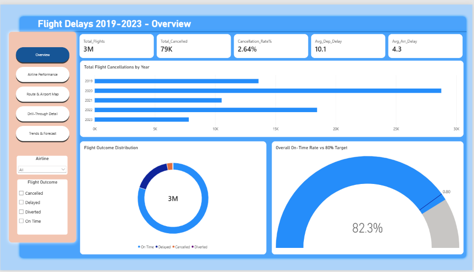
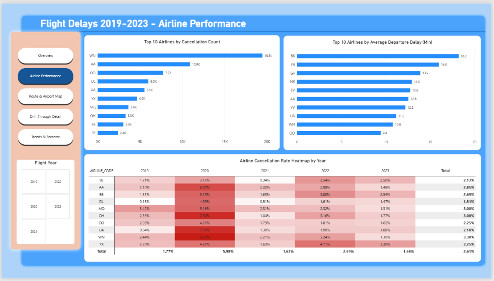
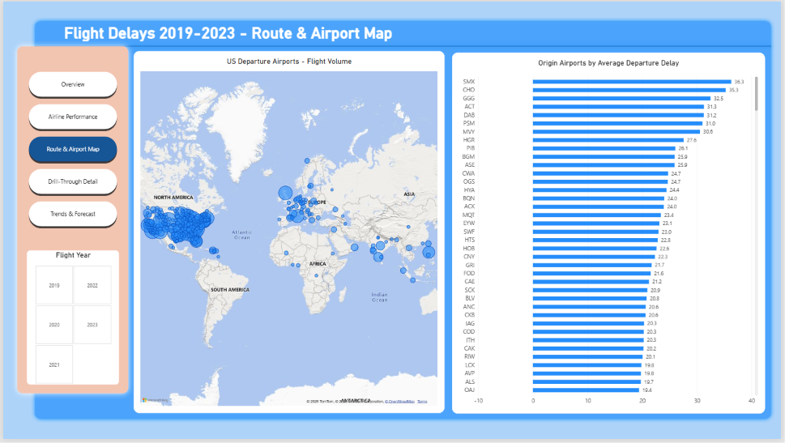
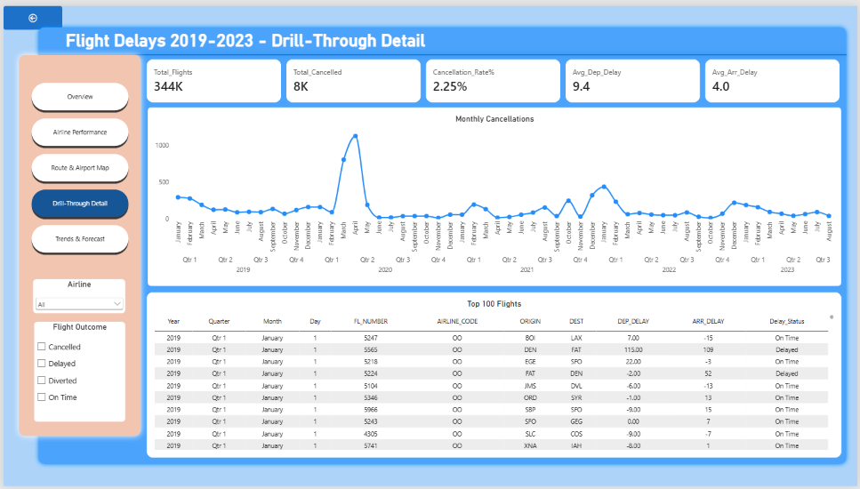
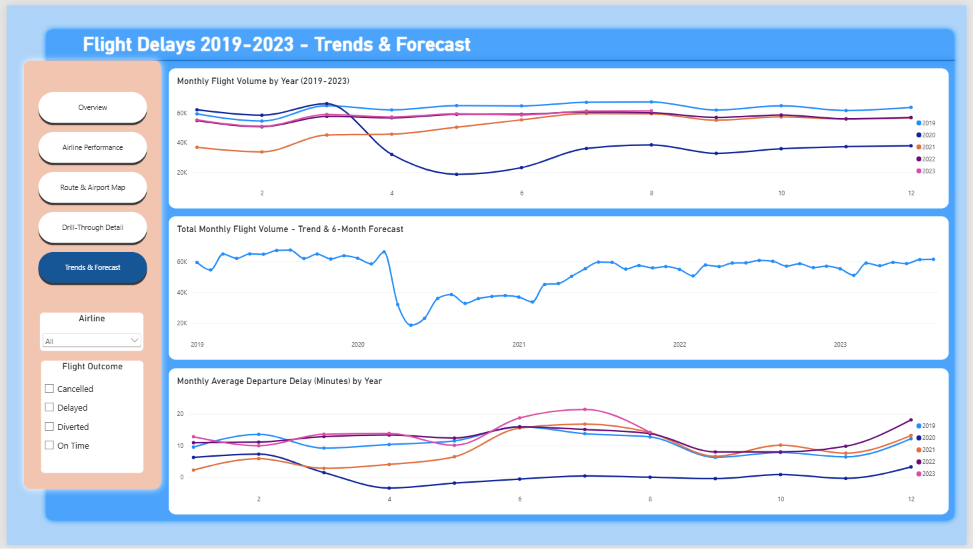

<div align="center">

# ✈️ Flight Delays & Cancellations 2019–2023
### A Power BI Analytics Project — 3 Million Flights, 5 Interactive Report Pages

[](https://powerbi.microsoft.com/)
[](https://learn.microsoft.com/dax/)
[]()

*3 million U.S. domestic flights, 5 years, one navigable dashboard — from cancellations by airline down to individual flight-level drill-through.*

</div>

---

## 🧭 Table of Contents

- [📌 Overview](#-overview)
- [✈️ The Dataset](#️-the-dataset)
- [📊 Dashboard Preview](#-dashboard-preview)
- [🔑 Key Metrics](#-key-metrics)
- [🧭 Navigation & Interactivity](#-navigation--interactivity)
- [⚙️ Tech Stack](#️-tech-stack)
- [🚀 Getting Started](#-getting-started)
- [📁 Repository Structure](#-repository-structure)
- [🎥 Video Walkthrough](#-video-walkthrough)
- [🙋 Author](#-author)

---

## 📌 Overview

This project analyzes **5 years of U.S. domestic flight data (2019–2023)** — 3 million flight
records — to answer three core questions: which airlines cancel and delay most, where are
delays geographically concentrated, and how has flight volume and reliability trended (and
forecasted) over time. The report is built as a fully navigable 5-page experience with a custom
button-based menu, cross-filtering slicers, and a drill-through page for flight-level detail.

> `3M Flight Records` → `Cleaning & Type Correction` → `DAX Measures (Cancellation Rate, Avg Delay)` → `5-Page Interactive Report` → `Drill-Through & Forecasting`

---

## ✈️ The Dataset

<table>
<tr>
<td width="100%">

**U.S. Domestic Flights Sample (2019–2023)** — a 3-million-row sample covering flight
schedules, delays, cancellations, and diversions across U.S. carriers.

| Field | Detail |
|---|---|
| 🔢 Records | ~3,000,000 flights |
| 📅 Date Range | 2019 – 2023 |
| ✈️ Key Columns | `FL_DATE`, `AIRLINE`, `AIRLINE_CODE`, `ORIGIN`, `DEST`, `DEP_DELAY`, `ARR_DELAY`, `CANCELLED`, `CANCELLATION_CODE`, `DIVERTED`, `DISTANCE` |
| ⏱️ Delay Breakdown | Delay minutes attributed to Carrier, Weather, NAS, Security, and Late Aircraft |
| 🎯 Outcome Categories | On Time · Delayed · Cancelled · Diverted |

</td>
</tr>
</table>
  > 📦 **Dataset download:** `flights_sample_3m.csv` is too large for GitHub (~3M rows). Download
   it from Google Drive here: **[Download flights_sample_3m.csv](https://drive.google.com/file/d/1WND1dbx14VuApzXUhIVmSPk6PjKdDmF1/view?usp=sharing)** and place it inside the `Dataset/` folder before opening the `.pbix` file.

---

## 📊 Dashboard Preview

### 1️⃣ Overview



5 headline KPIs (Total Flights, Total Cancelled, Cancellation Rate, Avg Departure/Arrival
Delay), total cancellations by year, a flight-outcome donut, and an on-time-rate gauge tracked
against an 80% target.

### 2️⃣ Airline Performance



Top 10 airlines by cancellation count and by average departure delay, plus a year-by-year
cancellation-rate heatmap per airline — instantly surfacing which carriers and which years were
worst.

### 3️⃣ Route & Airport Map



A geographic map of U.S. departure airports sized by flight volume, paired with a ranked list of
origin airports by average departure delay.

### 4️⃣ Drill-Through Detail



A dedicated drill-through page — right-click any airline or airport elsewhere in the report to
land here, with monthly cancellation trends and a flight-level detail table (flight number,
route, delay minutes, status).

### 5️⃣ Trends & Forecast



Monthly flight volume by year, a 6-month forward forecast on total monthly volume, and monthly
average departure delay trends — used to spot the 2020 volume collapse and recovery pattern.

---

## 🔑 Key Metrics

<div align="center">

| ✈️ Total Flights | ❌ Total Cancelled | 📉 Cancellation Rate | 🛫 Avg. Departure Delay | 🛬 Avg. Arrival Delay |
|:---:|:---:|:---:|:---:|:---:|
| **3M** | **79K** | **2.64%** | **10.1 min** | **4.3 min** |

**Overall on-time rate: 82.3%** — tracked against an 80% performance target on the Overview page.

</div>

---

## 🧭 Navigation & Interactivity

- **Custom button-based navigation menu** on every page — no default page tabs, styled to match
  the report theme
- **Cross-page slicers**: Airline, Flight Outcome (Cancelled/Delayed/Diverted/On Time), and
  Flight Year — persist filtering across pages
- **Drill-through**: right-click any airline or airport visual to jump to the flight-level
  Drill-Through Detail page with full context carried over
- **Forecast visual**: 6-month forward projection layered directly onto the historical monthly
  trend line

---

## ⚙️ Tech Stack

| Category | Tools |
|---|---|
| 📊 BI Platform | Power BI Desktop |
| 📐 Calculations | DAX (Cancellation Rate %, Avg Delay measures) |
| 🔧 Data Prep | Power Query — type correction, delay-cause cleanup |
| 🗺️ Visuals | Map (ArcGIS/Bing), heatmap matrix, gauge, forecast line |
| 🗂️ Data Source | Single large CSV — 3M U.S. domestic flight records |

---

## 🚀 Getting Started

```bash
# 1. Clone the repo
git clone https://github.com/krish-desai-123/Power-BI.git
cd "Power-BI/Flight Delay and Cancellation"

# 2. Open the report
# Launch Power BI Desktop → Open → Flight Delay and Cancellation.pbix
```

If prompted for the data source path, point Power BI to `Dataset/flights_sample_3m.csv`. Then
`Home → Refresh` to reload. Note: this is a large file (~3M rows) — initial load may take a few
minutes.

---

## 📁 Repository Structure

```
Flight Delay and Cancellation/
├── Flight Delay and Cancellation.pbix   # Full Power BI report (5 pages)
├── README.md                            # You are here 👋
├── Dataset/
│   └── flights_sample_3m.csv
└── Assets/
    ├── overview.png
    ├── airline_performance.png
    ├── route_airport_map.png
    ├── drillthrough_detail.png
    └── trends_forecast.png
```

---

## 🎥 Video Walkthrough

[](https://youtu.be/t9N4xj2wv8E)

📺 **[▶ Watch the fvideo on YouTube](https://youtu.be/t9N4xj2wv8E)**


---

## 🙋 Author

**Krish Desai** — [@krish-desai-123](https://github.com/krish-desai-123)

<div align="center">

*⭐ If this project helped you understand Power BI dashboard design, consider starring the repo!*

</div>
