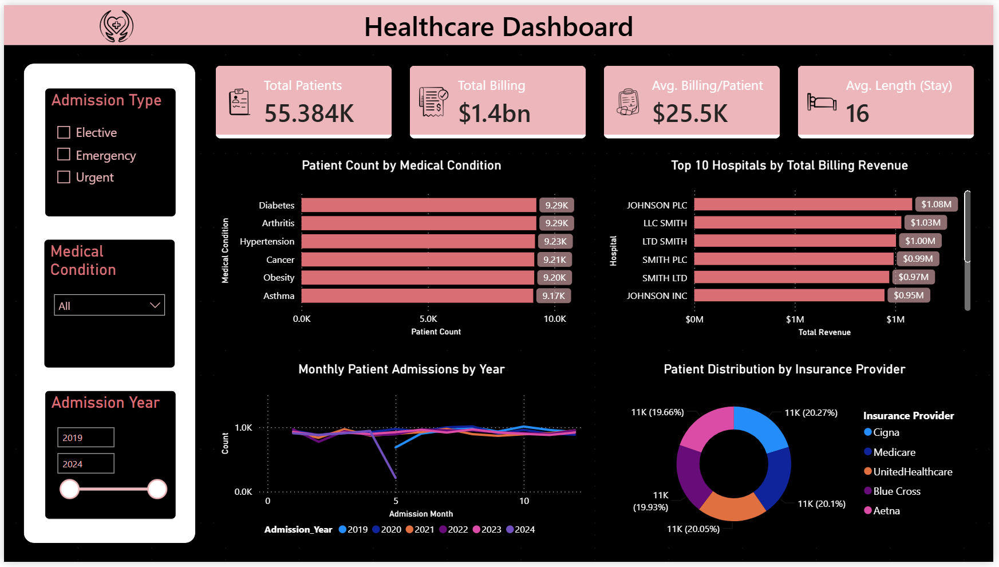
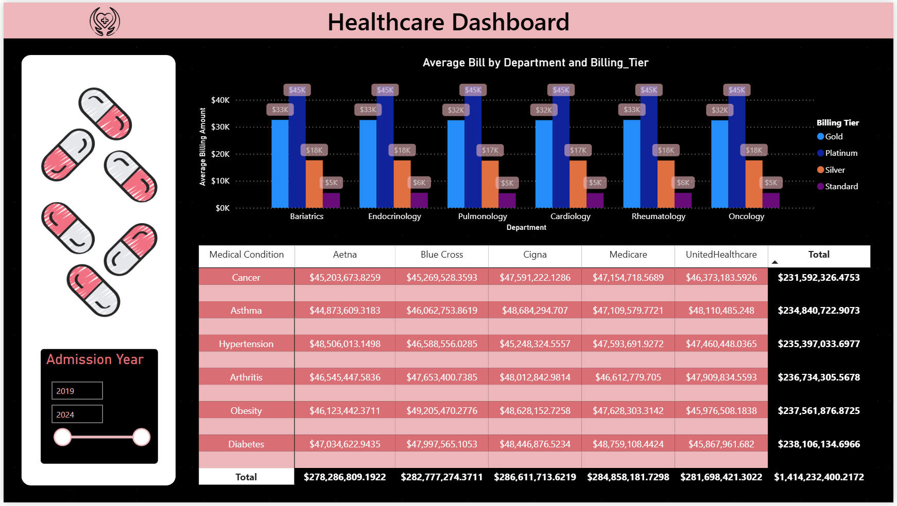
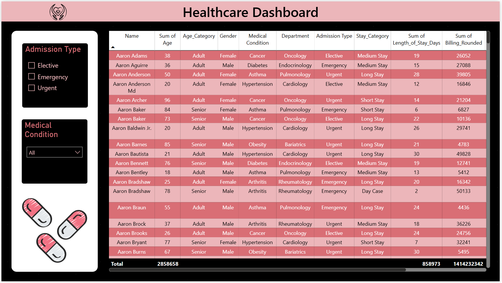

<div align="center">


# 🏥 Healthcare Patient Analytics Dashboard
### An End-to-End Power BI Project — Power Query, Data Modeling & Interactive Reporting

[](https://powerbi.microsoft.com/)
[](https://learn.microsoft.com/power-query/)
[](https://www.kaggle.com/datasets/prasad22/healthcare-dataset)
[]()

*Transforming 55,500 raw patient records into a 3-page interactive dashboard — from messy CSV to clinical decision-ready insight.*

</div>

---

## 🧭 Table of Contents

- [📌 Overview](#-overview)
- [🩺 The Dataset](#-the-dataset)
- [🛠️ Power Query Pipeline](#️-power-query-pipeline)
- [📊 Dashboard Preview](#-dashboard-preview)
- [🔑 Key Metrics](#-key-metrics)
- [🧩 Data Model](#-data-model)
- [⚙️ Tech Stack](#️-tech-stack)
- [🚀 Getting Started](#-getting-started)
- [📁 Repository Structure](#-repository-structure)
- [🎥 Video Walkthrough](#-video-walkthrough)
- [🙋 Author](#-author)

---

## 📌 Overview

This project turns a **55,500-row synthetic hospital records dataset** into a fully interactive,
3-page Power BI report. It's built to demonstrate the complete Power Query toolkit end-to-end:

> `Import & Storage Modes` → `Data Profiling` → `Text/Number/Date Cleaning` → `Conditional Columns` → `Group By` → `Pivot / Unpivot` → `Merge & Append` → `Parameters` → `Interactive Report`

Every transformation step exists for a reason — fixing negative billing values, standardizing
inconsistent name casing, deriving clinical risk flags — and the final report surfaces that clean
data through KPI cards, trend lines, and cross-filterable visuals across three dedicated pages.

---

## 🩺 The Dataset

<table>
<tr>
<td width="60%">

**Healthcare Dataset** — published on Kaggle by Prasad Patil, generated with Python's `Faker`
library to intentionally include realistic data-quality issues (mixed-case names, negative billing
values) for cleaning practice.

| Field | Detail |
|---|---|
| 🔢 Rows | 55,500 patient records |
| 📋 Columns | 15 (Name, Age, Gender, Condition, Billing, Insurance, etc.) |
| 🩹 Conditions | Cancer · Diabetes · Hypertension · Obesity · Asthma · Arthritis |
| 🏦 Insurers | Aetna · Blue Cross · Cigna · Medicare · UnitedHealthcare |
| 📦 Source | [Kaggle — Healthcare Dataset](https://www.kaggle.com/datasets/prasad22/healthcare-dataset) |

**Lookup table:** `Condition_Dept_Lookup.csv` — a manually built 6-row mapping from Medical
Condition → Hospital Department (e.g., Cancer → Oncology), merged into the main table in Power
Query.

</td>
<td width="40%" align="center">

<br>


</td>
</tr>
</table>

---

## 🛠️ Power Query Pipeline

Every step below was applied in Power Query Editor, with descriptive Applied Step names for full
traceability.

| Stage | What Was Done |
|---|---|
| 🔌 **Connect** | Both CSVs loaded via `Get Data → Text/CSV`, set to **Import mode** (justified — static local files, no live source) |
| 🔍 **Profile** | Column Quality, Distribution & Profile checked across all 55,500 rows — flagged negative billing values and inconsistent name casing |
| 🔤 **Text Cleanup** | Proper Case on `Name` & `Doctor`, UPPERCASE on `Hospital`, Trim + Clean applied throughout |
| 💵 **Fix Billing** | `Number.Abs()` to correct negative billing amounts → `Billing_Amount_Fixed`, then rounded → `Billing_Rounded` |
| 📅 **Dates** | `Date of Admission` & `Discharge Date` typed as Date; `Admission_Year`, `Admission_Month`, `Admission_Month_Num` extracted |
| 🛏️ **Derived Metric** | `Length_of_Stay_Days` calculated as Discharge − Admission |
| 🆔 **Index** | Sequential `Patient_ID` added |
| 🎯 **Conditional Columns** | `Age_Category` (Minor/Adult/Senior) · `Billing_Tier` (Standard→Platinum) · `Stay_Category` · `Risk_Flag` (based on Test Results) |
| 📊 **Group By** | 4 summary queries — `Condition_Summary`, `Hospital_Summary`, `Insurance_Summary`, `Monthly_Admissions` |
| 🔄 **Pivot / Unpivot** | Condition × Admission Type pivoted into columns, then unpivoted back — demonstrating both directions of reshaping |
| 🔗 **Merge** | `Condition_Dept_Lookup` merged in (Left Outer Join) to attach a `Department` to every record |
| ➕ **Append** | Data split by admission year and re-combined via `Append Queries` to simulate multi-file ingestion |
| ⚙️ **Parameters** | `MinAge` (Whole Number) & `AdmissionType` (Text list) — built for dynamic, reusable filtering |

---

## 📊 Dashboard Preview

### 1️⃣ Overview — KPIs, Trends & Distribution



4 KPI cards up top, condition & hospital breakdowns, a year-over-year admissions trend line, and
an insurance-provider donut — all cross-filterable by Admission Type, Medical Condition, and
Admission Year.

### 2️⃣ Billing Analysis — Department × Tier Breakdown



Average billing by department, split across four billing tiers (Standard → Platinum), plus a
matrix cross-tabbing Medical Condition against Insurance Provider revenue.

### 3️⃣ Patient Detail — Full Record Table



Row-level detail for every patient, filterable by Admission Type and Medical Condition — built for
drill-down analysis.

---

## 🔑 Key Metrics

<div align="center">

| 👥 Total Patients | 💰 Total Billing | 📈 Avg. Billing / Patient | 🛏️ Avg. Length of Stay |
|:---:|:---:|:---:|:---:|
| **55.384K** | **$1.4bn** | **$25.5K** | **16 days** |

</div>

---

## 🧩 Data Model

```
healthcare_dataset (main)
        │
        ├── merged with ──▶ Condition_Dept_Lookup   (Medical Condition → Department)
        │
        ├── grouped into ─▶ Condition_Summary        (Patient_Count, Avg_Billing, Avg_LOS)
        ├── grouped into ─▶ Hospital_Summary          (Total_Patients, Total_Revenue)
        ├── grouped into ─▶ Insurance_Summary         (Covered_Patients, Total_Claims)
        └── grouped into ─▶ Monthly_Admissions        (Monthly_Count, Monthly_Revenue)
```

3 slicers (Admission Type, Medical Condition, Admission Year) drive cross-filtering across every
visual on the Overview page, with page- and visual-level filters layered on top for cleaner
default views.

---

## ⚙️ Tech Stack

| Category | Tools |
|---|---|
| 📊 BI Platform | Power BI Desktop |
| 🔧 Data Prep | Power Query (M Language) |
| 🗂️ Data Source | CSV (Kaggle Healthcare Dataset + custom lookup table) |
| 🎨 Design | Built-in Power BI theme, custom KPI icon set |

---

## 🚀 Getting Started

```bash
# 1. Clone the repo
git clone https://github.com/krish-desai-123/Power-BI.git
cd "Power-BI/Healthcare"

# 2. Open the report
# Launch Power BI Desktop → Open → Healthcare.pbix
```

If prompted for data source paths, point Power BI to the `Dataset/` folder:
- `Dataset/healthcare_dataset.csv`
- `Dataset/Condition_Dept_Lookup.csv`

Then `Home → Refresh` to reload the latest data.

---

## 📁 Repository Structure

```
Healthcare/
├── Healthcare.pbix              # Full Power BI report (3 pages)
├── README.md                    # You are here 👋
├── Dataset/
│   ├── healthcare_dataset.csv
│   └── Condition_Dept_Lookup.csv
└── Assets/
    ├── dashboard_overview.png
    ├── billing_analysis.png
    ├── patient_detail_table.png
    └── (icon set: patient, billing, pills, payment, etc.)
```

---

## 🎥 Video 

[](https://youtu.be/ifBfD3_-V2U)

📺 **[▶ Watch the video on YouTube](https://youtu.be/ifBfD3_-V2U)**

---

## 🙋 Author

**Krish Desai** — [@krish-desai-123](https://github.com/krish-desai-123)

<div align="center">

*⭐ If this dashboard helped you understand Power Query and Power BI fundamentals, consider starring the repo!*

</div>
