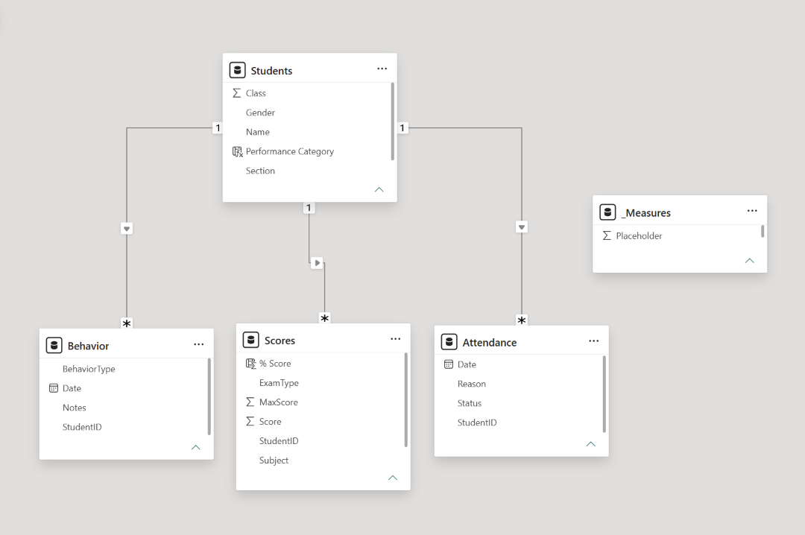
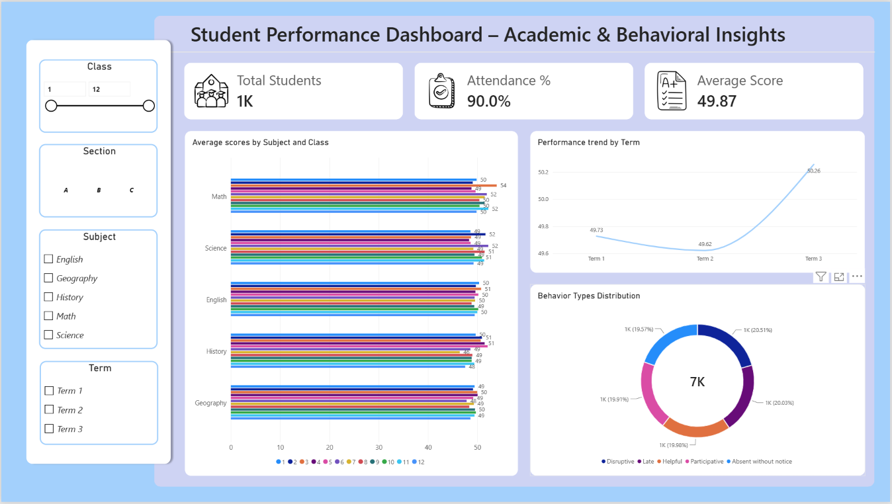
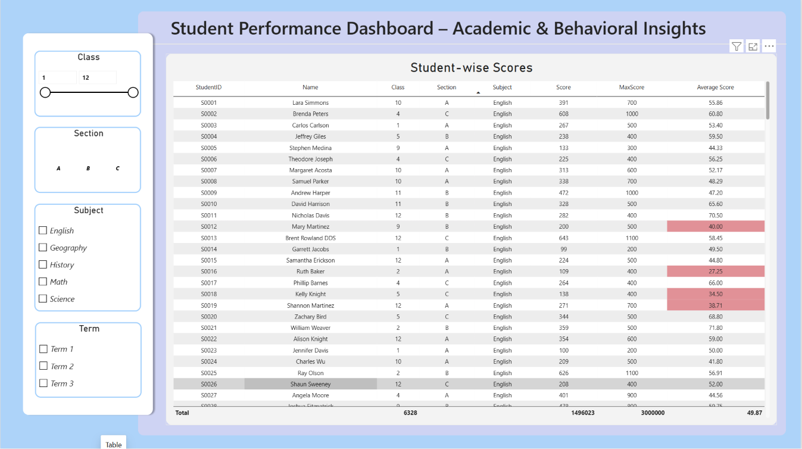

<div align="center">


# 🎓 Student Performance Dashboard
### Academic & Behavioral Insights — A Power BI Data Modeling & DAX Project

[](https://powerbi.microsoft.com/)
[](https://learn.microsoft.com/dax/)
[]()

*1,000 students, 4 linked tables, and a full academic + behavioral analytics report — built star-schema first.*

</div>

---

## 🧭 Table of Contents

- [📌 Overview](#-overview)
- [🗂️ The Dataset](#️-the-dataset)
- [🧩 Data Model](#-data-model)
- [🧮 DAX Measures](#-dax-measures)
- [📊 Dashboard Preview](#-dashboard-preview)
- [🔑 Key Metrics](#-key-metrics)
- [⚙️ Tech Stack](#️-tech-stack)
- [🚀 Getting Started](#-getting-started)
- [📁 Repository Structure](#-repository-structure)
- [🎥 Video Walkthrough](#-video-walkthrough)
- [🙋 Author](#-author)

---

## 📌 Overview

This project builds an interactive Power BI dashboard analyzing **academic performance,
attendance, and behavior** across a student body of 1,000 — spanning grades 1 through 12,
3 sections, 5 subjects, and 3 academic terms. Four independent datasets (Students, Scores,
Attendance, Behavior) are modeled into a clean **one-to-many star schema**, then layered with
DAX measures and conditional-formatted visuals to surface where students are excelling, where
they're falling behind, and how attendance and behavior connect to academic outcomes.

> `4 Raw CSVs` → `Star Schema Modeling` → `DAX Measures (% Score, Attendance %, Performance Category)` → `Conditional Formatting` → `Interactive Report`

---

## 🗂️ The Dataset

<table>
<tr>
<td width="60%">

Four linked CSV files, all keyed off `StudentID`.

| File | Role | Key Columns |
|---|---|---|
| `Students.csv` | Dimension — student roster | StudentID, Name, Gender, Class, Section |
| `Scores.csv` | Fact — exam results | StudentID, Subject, ExamType, Score, MaxScore, Term |
| `Attendance.csv` | Fact — daily attendance | StudentID, Date, Status (Present/Absent), Reason |
| `Behavior.csv` | Fact — behavioral incidents | StudentID, Date, BehaviorType, Notes |

| Field | Detail |
|---|---|
| 👥 Students | 1,000 |
| 📝 Score records | 30,000 |
| 📅 Attendance records | 100,000 |
| ⚠️ Behavior records | 6,500 |
| 🏫 Classes / Sections | Grades 1–12 · Sections A/B/C |
| 📚 Subjects | English · Math · Science · History · Geography |

</td>
<td width="40%" align="center">

<br>


</td>
</tr>
</table>

---

## 🧩 Data Model



`Students` sits at the center as the single dimension table, with three fact tables —
`Scores`, `Attendance`, and `Behavior` — each linked One-to-Many via `StudentID`. All DAX
measures live in a dedicated `_Measures` table, kept separate from the raw data.

| Relationship | Cardinality |
|---|---|
| Students → Scores | 1 : * |
| Students → Attendance | 1 : * |
| Students → Behavior | 1 : * |

---

## 🧮 DAX Measures

| Measure | Formula Concept | Purpose |
|---|---|---|
| `% Score` | `Score / MaxScore` | Normalizes exam results across different max-score scales |
| `Average Score per Subject` | `AVERAGE` aggregation | Powers the subject/class bar chart |
| `Attendance %` | Present days ÷ total days | Feeds the Attendance KPI card |
| `Behavior Count per Term` | `COUNT` with term filter | Drives the behavior distribution donut |
| `Performance Category` | `SWITCH` / `IF` on average % score | Buckets students into High / Medium / Low performers |

Conditional formatting (red/green thresholds at <40% and >80%) is applied directly on the
**Student-wise Scores** table so at-risk students are visually flagged without needing a
separate visual.

---

## 📊 Dashboard Preview

### 1️⃣ Main — Academic & Behavioral Overview



3 KPI cards (Total Students, Attendance %, Average Score), average scores by subject and class,
a performance trend across terms, and a behavior-type distribution donut — all filterable by
Class, Section, Subject, and Term.

### 2️⃣ Table — Student-wise Scores



Row-level detail for every student's score, with **conditional formatting** — red highlights
flag scores below 40%, making at-risk students immediately visible without extra filtering.

---

## 🔑 Key Metrics

<div align="center">

| 👥 Total Students | ✅ Attendance % | 📊 Average Score |
|:---:|:---:|:---:|
| **1K** | **90.0%** | **49.87** |

</div>

---

## ⚙️ Tech Stack

| Category | Tools |
|---|---|
| 📊 BI Platform | Power BI Desktop |
| 📐 Calculations | DAX (measures, SWITCH-based categorization) |
| 🔧 Data Prep | Power Query — column cleaning, type correction, null handling |
| 🗂️ Data Source | 4 linked CSVs (Students, Scores, Attendance, Behavior) |
| 🎨 Design | Custom KPI icon set, conditional formatting |

---

## 🚀 Getting Started

```bash
# 1. Clone the repo
git clone https://github.com/krish-desai-123/Power-BI.git
cd "Power-BI/Student Performance - EXAM"

# 2. Open the report
# Launch Power BI Desktop → Open → Student Performance Dashboard.pbix
```

If prompted for data source paths, point Power BI to the `Dataset/` folder containing all 4
CSVs. Then `Home → Refresh` to reload.

---

## 📁 Repository Structure

```
Student Performance - EXAM/
├── Student Performance Dashboard.pbix   # Full Power BI report
├── README.md                            # You are here 👋
├── Dataset/
│   ├── Students.csv
│   ├── Scores.csv
│   ├── Attendance.csv
│   └── Behavior.csv
└── Assets/
    ├── dashboard_overview.png
    ├── student_scores_table.png
    ├── model_view.png
    └── (icon set: Total Students, Average Score, Attendance)
```

---

## 🎥 Video Walkthrough

[](https://www.youtube.com/watch?v=SEuP4Zd-2cY)

📺 **[▶ Watch the video on YouTube](https://www.youtube.com/watch?v=SEuP4Zd-2cY)**


---

## 🙋 Author

**Krish Desai** — [@krish-desai-123](https://github.com/krish-desai-123)

<div align="center">

*⭐ If this project helped you understand Power BI data modeling and DAX, consider starring the repo!*

</div>
