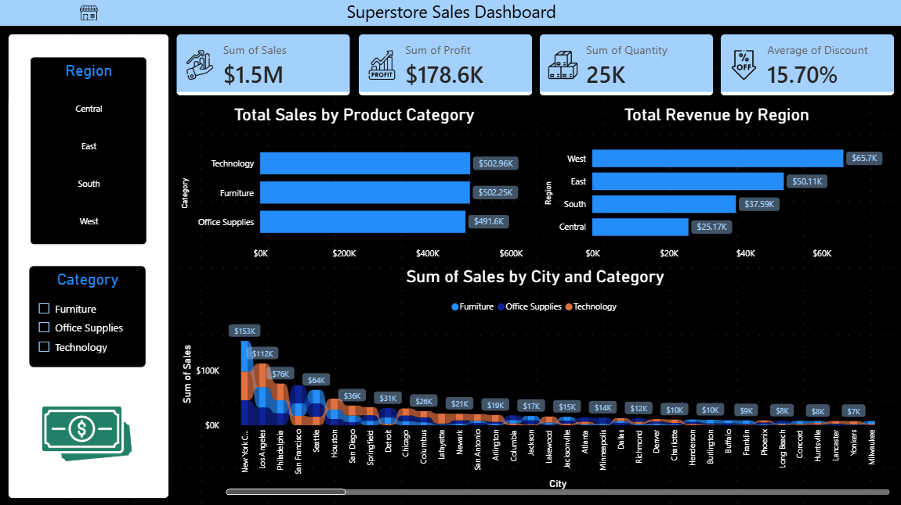

<div align="center">

#  Superstore Sales Dashboard

**An interactive Power BI dashboard delivering end-to-end sales intelligence across regions, categories, and cities for a US-based retail superstore.**

[](#)
[](#)
[](#)

</div>

<br>

## 🌟 Project Overview

This Power BI dashboard transforms raw transactional data from a US-based superstore into a clean, interactive analytics experience. Covering **9,994 records** across **49 states**, **531 cities**, and **793 unique customers**, the report surfaces key business KPIs, revenue breakdowns by region and product category, and city-level sales trends — all filterable by Region and Category through built-in slicers.

---

## 📽️ Dashboard Preview

https://github.com/krish-desai-123/Power-BI/Superstore Sales/Video.mp4

> *Full interactive walkthrough of the Superstore Sales Dashboard — slicers, KPI cards, and chart drill-downs.*

---

## 📸 Screenshot



---

## 📊 Key Metrics

|  |  |  |  |
|:---:|:---:|:---:|:---:|
| **Sum of Sales** | **Sum of Profit** | **Sum of Quantity** | **Avg Discount** |
| $1.5M | $178.6K | 25K | 15.70% |

---

## 📂 Repository Structure

```text
📦 Superstore-Sales-Dashboard
 ┣ 📂 assets
 ┃ ┣ 📜 superstore.png       # Store icon
 ┃ ┣ 📜 sales.png            # Sales KPI icon
 ┃ ┣ 📜 profit.png           # Profit KPI icon
 ┃ ┣ 📜 quantity.png         # Quantity KPI icon
 ┃ ┣ 📜 discount.png         # Discount KPI icon
 ┃ ┗ 📜 money.png            # Money icon (sidebar)
 ┣ 📜 Superstore_Sales.pbix  # Power BI report file
 ┣ 📜 Superstore.csv         # Raw dataset (9,994 records × 21 columns)
 ┣ 📜 Screenshot.png         # Dashboard screenshot
 ┗ 📜 Video.mp4              # Dashboard walkthrough recording
```

---

## 📋 Dataset Overview

The `Superstore.csv` file contains **9,994 transactional records** across **21 columns** spanning orders placed across the United States.

| Column | Description |
|---|---|
| `Order ID` | Unique order identifier |
| `Order Date` / `Ship Date` | Order and shipping timestamps |
| `Ship Mode` | Delivery class (Standard, Second Class, etc.) |
| `Customer ID` / `Customer Name` | Customer identifiers |
| `Segment` | Consumer, Corporate, or Home Office |
| `Region` | Central, East, South, West |
| `Category` | Furniture, Office Supplies, Technology |
| `Sub-Category` | Detailed product group |
| `Sales` | Revenue per line item |
| `Quantity` | Units sold |
| `Discount` | Discount applied (0–1 scale) |
| `Profit` | Net profit per line item |

---

## 📈 Dashboard Visuals

### KPI Cards
Four headline cards sit at the top of the report, each paired with a custom icon from the assets folder:

-  **Sum of Sales** — total revenue across all orders
-  **Sum of Profit** — net profit after discounts and costs
-  **Sum of Quantity** — total units sold
-  **Average Discount** — mean discount rate across all transactions

### Total Sales by Product Category *(Horizontal Bar)*
Breaks down revenue across the three product categories — Technology ($502.96K), Furniture ($502.25K), and Office Supplies ($491.6K) — showing near-equal contribution across all three.

### Total Revenue by Region *(Horizontal Bar)*
Ranks the four US regions by profit contribution. West leads at $65.7K, followed by East ($50.11K), South ($37.59K), and Central ($25.17K).

### Sum of Sales by City and Category *(Stacked Area)*
A scrollable city-level chart showing sales split by Furniture, Office Supplies, and Technology. New York City leads at $153K, followed by Los Angeles ($112K) and Philadelphia ($76K).

### Slicers
- **Region** — filter by Central, East, South, or West
- **Category** — filter by Furniture, Office Supplies, or Technology

---

## ⚙️ Getting Started

### Prerequisites

- [Power BI Desktop](https://powerbi.microsoft.com/desktop/) (free)

### 1. Clone the Repository

```bash
git clone https://github.com/krish-desai-123/Superstore-Sales-Dashboard.git
cd Superstore-Sales-Dashboard
```

### 2. Open the Report

Open `Superstore_Sales.pbix` in Power BI Desktop. The data source is already embedded — no reconnection required.

### 3. Explore the Dashboard

Use the **Region** and **Category** slicers on the left panel to filter all visuals simultaneously. Hover over any chart element for detailed tooltips.

---

## 👨‍💻 Author

**Krish Desai**

* GitHub: [@krish-desai-123](https://github.com/krish-desai-123)

---

<div align="center">
<i>If this dashboard helped you understand Power BI reporting better, consider dropping a ⭐!</i>
</div>
